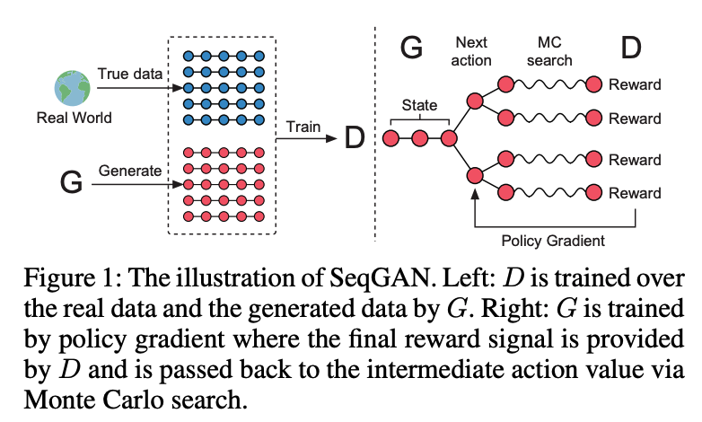

# DeepGenerativeModelProject

## 项目结构
- eda文件是easy data augment方法的实现，通过运行main.py文件使用此方法。
- seqGAN文件是seqGAN模型的实现。通过main.py运行。

## SeqGAN模型结构
<div align="center">
	
</div>


## 运行
```bash
python main.py
```

## Reference
* [1] [SeqGAN: Sequence Generative Adversarial Nets with Policy Gradient](https://arxiv.org/pdf/1609.05473.pdf)
* [2] [EDA: Easy Data Augmentation Techniques for Boosting Performance on Text Classification Tasks](https://arxiv.org/pdf/1901.11196.pdf)
